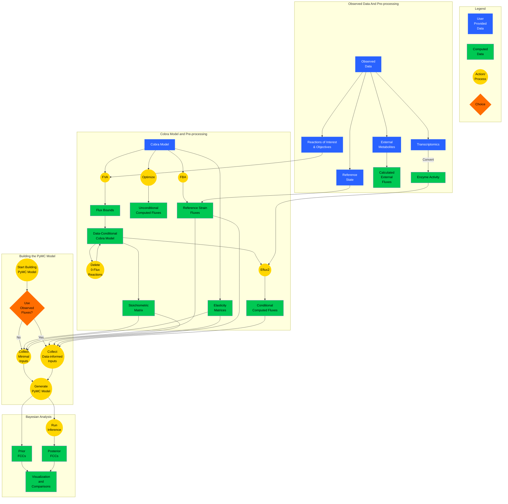

# syn_bmca

A repository for hosting the data and code for Synechococcus elongatus using Bayesian Metabolic Control Analysis.

```mermaid
flowchart TD
 subgraph Legend["Legend"]
        UserData["User \n Provided \n Data"]
        CompData["Computed \n Data"]
        Action(("Action/ \n Process"))
        Choice{"Choice"}
  end
 subgraph ObservedData["Observed Data And Pre-processing"]
        TranscData["Transcriptomics"]
        ExMetab["External \n Metabolites"]
        RxnConstr["Reactions of Interest \n & Objectives"]
        RefSt["Reference \n State"]
        Data["Observed \n Data"]
        CalcExFlux["Calculated \n External \n Fluxes"]
        EnzAct["Enzyme Activity"]
  end
 subgraph CobraModel["Cobra Model and Pre-processing"]
        FVA(("FVA"))
        ElastMat["Elasticity \n Matrices"]
        StoichMat["Stoichiometric \n Matrix"]
        Optimize(("Optimize"))
        FBA(("FBA"))
        OrigCobra["Cobra Model"]
        FluxBounds["Flux Bounds"]
        RefCobra["Data-Conditional \n Cobra Model"]
        UncondCompFlux["Unconditional \n Computed Fluxes"]
        RefStFlux["Reference Strain \n Fluxes"]
        DelZeroFlux(("Delete \n 0-Flux \n Reactions"))
        Eflux(("Eflux2"))
        CondCompFluxes["Conditional \n Computed Fluxes"]
  end
 subgraph PyMC["Building the PyMC Model"]
        StartPyMC(("Start Building \n PyMC Model"))
        ChckObsFlux{"Use \n Observed \n Fluxes?"}    
        GetInputsBasic(("Collect \n Minimal \n Inputs"))
        CreatePyMC(("Generate \n PyMC Model"))
        GetInputsData(("Collect \n Data-informed \n Inputs"))
  end
  subgraph Bayes["Bayesian Analysis"]
        RunInf(("Run \n Inference"))
        Priors["Prior \n FCCs"]
        Post["Posterior \n FCCs"]
        Viz["Visualization \n and \n Comparisons"]
  end


    Data --> TranscData & ExMetab & RxnConstr & RefSt
        ExMetab --> CalcExFlux
        TranscData -- Convert --> EnzAct
    
    OrigCobra --> FVA & ElastMat & Optimize & FBA
        RxnConstr --> FVA
        FVA --> FluxBounds
        FluxBounds --> RefCobra
        Optimize --> UncondCompFlux
        FBA --> RefStFlux
        RefSt --> RefStFlux
        RefCobra --> DelZeroFlux --> RefCobra --> Eflux & StoichMat
        Eflux --> CondCompFluxes
        EnzAct --> Eflux
    
    StartPyMC --> ChckObsFlux
        ChckObsFlux -- No --> GetInputsBasic
            StoichMat --> GetInputsBasic
            ElastMat --> GetInputsBasic
            RefStFlux --> GetInputsBasic
            GetInputsBasic --> CreatePyMC
        ChckObsFlux -- Yes --> GetInputsData
            StoichMat --> GetInputsData
            ElastMat --> GetInputsData
            RefStFlux --> GetInputsData
            CondCompFluxes --> GetInputsData
            GetInputsData --> CreatePyMC
    
    CreatePyMC --> RunInf & Priors
        RunInf --> Post
        Priors & Post --> Viz
    
    style UserData stroke:#2962FF,fill:#2962FF,color:#FFFFFF
    style Data stroke:#2962FF,fill:#2962FF,color:#FFFFFF
    style TranscData stroke:#2962FF,fill:#2962FF,color:#FFFFFF
    style ExMetab stroke:#2962FF,fill:#2962FF,color:#FFFFFF
    style RxnConstr stroke:#2962FF,fill:#2962FF,color:#FFFFFF
    style RefSt stroke:#2962FF,fill:#2962FF,color:#FFFFFF
    style OrigCobra stroke:#2962FF,fill:#2962FF,color:#FFFFFF
    
    style CompData fill:#00C853,color:#000000
    style CalcExFlux fill:#00C853,color:#000000
    style EnzAct fill:#00C853,color:#000000
    style ElastMat fill:#00C853,color:#000000
    style FluxBounds fill:#00C853,color:#000000
    style RefCobra fill:#00C853,color:#000000
    style UncondCompFlux fill:#00C853,color:#000000
    style StoichMat fill:#00C853,color:#000000
    style CondCompFluxes fill:#00C853,color:#000000
    style RefStFlux fill:#00C853,color:#000000
    style Priors fill:#00C853,color:#000000
    style Post fill:#00C853,color:#000000
    style Viz fill:#00C853,color:#000000

    style Action stroke:#FFD600,stroke-width:4px,stroke-dasharray: 0,fill:#FFD600,color:#000000
    style FVA stroke:#FFD600,stroke-width:4px,stroke-dasharray: 0,fill:#FFD600,color:#000000
    style FBA stroke:#FFD600,stroke-width:4px,stroke-dasharray: 0,fill:#FFD600,color:#000000
    style Optimize stroke:#FFD600,stroke-width:4px,stroke-dasharray: 0,fill:#FFD600,color:#000000
    style DelZeroFlux stroke:#FFD600,stroke-width:4px,stroke-dasharray: 0,fill:#FFD600,color:#000000
    style Eflux fill:#FFD600,stroke:#FFD600,stroke-width:4px,stroke-dasharray: 0,color:#000000
    style StartPyMC fill:#FFD600,stroke:#FFD600,stroke-width:4px,stroke-dasharray: 0,color:#000000
    style GetInputsBasic fill:#FFD600,stroke:#FFD600,stroke-width:4px,stroke-dasharray: 0,color:#000000
    style GetInputsData fill:#FFD600,stroke:#FFD600,stroke-width:4px,stroke-dasharray: 0,color:#000000
    style CreatePyMC fill:#FFD600,stroke:#FFD600,stroke-width:4px,stroke-dasharray: 0,color:#000000
    style RunInf fill:#FFD600,stroke:#FFD600,stroke-width:4px,stroke-dasharray: 0,color:#000000

    style Choice stroke:#FF6D00,stroke-width:4px,stroke-dasharray: 0,fill:#FF6D00,color:#000000
    style ChckObsFlux stroke:#FF6D00,stroke-width:4px,stroke-dasharray: 0,fill:#FF6D00,color:#000000
```